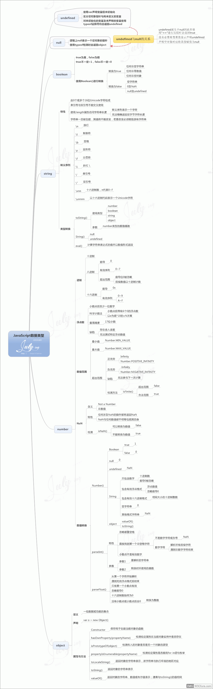

# 知识点拓扑图

目录

## 前端工程化

## 饥人谷前端知识

## 1-JavaScript-变量

## 2-JavaScript-数据类型

## 3-Javascript-运算符

## 4-JavaScript-流程控制

## 5-JavaScript-函数基础

## 6-JavaScript-数组

## 7-JavaScript-字符串函数

## 8-JavaScript-正则表达式

## 9-JavaScript-DOM-基本操作

## 10-Window-对象

